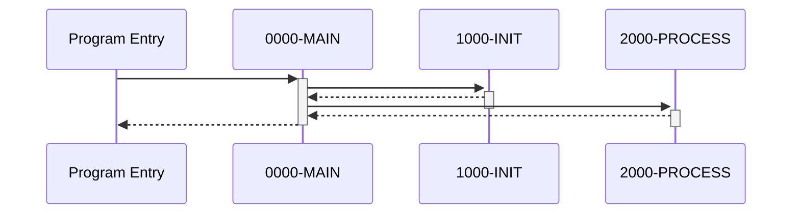

# Specter

Specter takes a JSON abstract syntax tree and generates a standalone, executable Python module that simulates the original program's behavior.

## How It Works

Specter reads a structured JSON AST file where the program is organized into named paragraphs, each containing a tree of typed statements (MOVE, IF, PERFORM, COMPUTE, etc.). It walks this tree and produces Python source code where:

- Each paragraph becomes a Python function
- All program state lives in a single flat dictionary
- Control flow (conditionals, loops, subroutine calls) is translated into native Python equivalents
- External calls and embedded SQL/CICS blocks are captured as stubs for analysis

The generated code is self-contained — no runtime dependencies, no imports. You can execute it directly or feed it initial state and inspect the result programmatically.

## Monte Carlo Analysis

Specter can run the generated code thousands of times with randomized inputs to explore execution paths. The pipeline works as follows:

1. **Variable classification** — the variable extractor analyzes the AST to discover all variables and classify each as `input`, `internal`, `status`, or `flag` based on naming conventions and access patterns (e.g., read-before-write = input).

2. **Domain-aware input generation** — each iteration generates randomized values tailored to each variable's classification:
   - **Status variables** receive realistic status codes: file status (`00`, `10`, `21`...), IMS (`GE`, `GB`, `II`...), SQLCODE (`0`, `100`, `-803`...), CICS EIBRESP codes, EIBAID key values.
   - **Flags** get `True`/`False`.
   - **Input variables** use name-based heuristics: DATE-like names get random dates, AMT/AMOUNT get random dollar amounts, KEY/ID get random numeric identifiers, CNT/COUNT get small integers, FLAG/FLG get `Y`/`N`, etc.

3. **Execution** — the generated module is dynamically loaded and its `run()` function is called with the randomized initial state. Each paragraph function operates on the shared `state` dict, and the runtime captures DISPLAY output, external CALLs, EXEC SQL/CICS/DLI blocks, file reads/writes, and abend signals.

4. **Aggregation** — results across all iterations are combined into a report showing call/exec frequencies, display message patterns (with counts), error rates, and abend counts. This reveals which execution paths are reachable under different input conditions.

## Dynamic Analysis

The `--analyze` flag enables instrumented code generation for deeper runtime analysis. When active, the generated code uses a dict subclass (`_InstrumentedState`) that automatically records every variable read and write, along with paragraph-level execution tracing. This is opt-in — normal code generation has zero overhead.

After running Monte Carlo iterations with instrumentation, Specter produces an analysis report covering:

- **Paragraph coverage** — which paragraphs were reached across all iterations, and which are dead code.
- **Call graph** — paragraph-to-paragraph call relationships observed at runtime.
- **Variable activity** — read/write counts per variable, identification of dead writes (written but never read) and read-only variables (read but never written).
- **State change tracking** — which variables changed in every run, sometimes, or never, with common final values.

Example output:

```
=== Dynamic Analysis (100 iterations) ===

Paragraph Coverage: 87/120 (72.5%)
  Dead: 9999-ABEND, 8000-ERROR-HANDLER, ...

Call Graph (top callers):
  0000-MAIN -> 1000-INIT, 2000-PROCESS, 9000-CLEANUP
  2000-PROCESS -> 2100-VALIDATE, 2200-COMPUTE

Variable Activity:
  Most written: WS-STATUS (450), WS-AMOUNT (320)
  Read-only: CUSTOMER-ID, ACCOUNT-NUM
  Dead writes: WS-TEMP-1

State Changes:
  Always changed: WS-STATUS (100/100), WS-RETURN-CODE (100/100)
  Sometimes: WS-AMOUNT (73/100), WS-ERROR-MSG (12/100)
  Never: WS-FILLER, WS-PROGRAM-NAME
```

## Execution Diagrams

The `--diagram` flag generates Mermaid sequence and flow diagrams from actual execution traces. These show the runtime call flow between paragraphs — not a static approximation, but the real paths taken during Monte Carlo iterations.

Three diagram types are produced:

- **Sequence diagram** (`_sequence.mmd`) — shows the call/return flow of a single representative iteration, with proper nesting depth. Useful for understanding the exact order of paragraph execution.
- **Flow diagram** (`_flow.mmd`) — shows paragraph call relationships with hit counts for one iteration. A compact view of which paragraphs called which.
- **Aggregated flow** (`_aggregated_flow.mmd`) — combines call relationships across all coverage-expanding iterations with cumulative counts. Shows the most-exercised paths and hot paragraphs across the full analysis run.

All diagrams are output as `.mmd` (Mermaid markdown) files. Render them with any Mermaid-compatible tool: the [Mermaid Live Editor](https://mermaid.live), VS Code extensions, GitHub markdown preview, or `mmdc` CLI.

Example sequence diagram output:



## Usage

```
specter program.ast                          # generate program.py
specter program.ast -o out.py                # custom output path
specter program.ast --verify                 # check generated code compiles
specter program.ast --monte-carlo 1000       # run 1000 random iterations
specter program.ast -m 5000 --seed 7         # custom iteration count and seed
specter program.ast --analyze                # dynamic analysis (100 MC iterations)
specter program.ast --analyze -m 500         # analysis with custom iteration count
specter program.ast --guided -m 10000        # coverage-guided fuzzing (best mode)
specter program.ast --diagram                # generate execution diagrams (implies --analyze)
specter program.ast --guided --diagram       # guided fuzzing + diagrams
specter program.ast --analyze --analysis-output ./reports  # write output to custom dir
```

## GnuCOBOL Validation

The `tests/cobol_validation/` directory contains 58 COBOL test programs that validate Specter's code generation against GnuCOBOL. Each test compiles and runs with GnuCOBOL, then parses the same source through ProLeap and Specter, comparing DISPLAY output. Run with:

```
python3 tests/cobol_validation/run_validation.py
```

Requires GnuCOBOL (`cobc`) and the ProLeap wrapper JAR.

## Requirements

Python 3.10+. No external dependencies.
