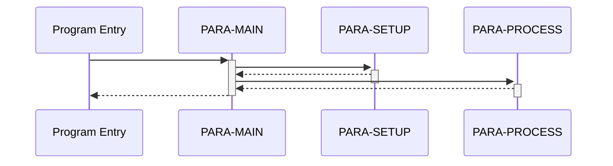

# Specter

Specter takes a JSON abstract syntax tree and generates a standalone, executable Python module that simulates the original program's behavior.

## How It Works

Specter reads a structured JSON AST file where the program is organized into named paragraphs, each containing a tree of typed statements (MOVE, IF, PERFORM, COMPUTE, etc.). It walks this tree and produces Python source code where:

- Each paragraph becomes a Python function
- All program state lives in a single flat dictionary
- Control flow (conditionals, loops, subroutine calls) is translated into native Python equivalents
- External calls and embedded SQL/CICS blocks are captured as stubs for analysis

The generated code is self-contained — no runtime dependencies, no imports. You can execute it directly or feed it initial state and inspect the result programmatically.

## Monte Carlo Analysis

Specter can run the generated code thousands of times with randomized inputs to explore execution paths. The pipeline works as follows:

1. **Variable classification** — the variable extractor analyzes the AST to discover all variables and classify each as `input`, `internal`, `status`, or `flag` based on naming conventions and access patterns (e.g., read-before-write = input).

2. **Domain-aware input generation** — each iteration generates randomized values tailored to each variable's classification:
   - **Status variables** receive realistic status codes: file status (`00`, `10`, `21`...), IMS (`GE`, `GB`, `II`...), SQLCODE (`0`, `100`, `-803`...), CICS EIBRESP codes, EIBAID key values.
   - **Flags** get `True`/`False`.
   - **Input variables** use name-based heuristics: DATE-like names get random dates, AMT/AMOUNT get random dollar amounts, KEY/ID get random numeric identifiers, CNT/COUNT get small integers, FLAG/FLG get `Y`/`N`, etc.

3. **Execution** — the generated module is dynamically loaded and its `run()` function is called with the randomized initial state. Each paragraph function operates on the shared `state` dict, and the runtime captures DISPLAY output, external CALLs, EXEC SQL/CICS/DLI blocks, file reads/writes, and abend signals.

4. **Aggregation** — results across all iterations are combined into a report showing call/exec frequencies, display message patterns (with counts), error rates, and abend counts. This reveals which execution paths are reachable under different input conditions.

## Dynamic Analysis

The `--analyze` flag enables instrumented code generation for deeper runtime analysis. When active, the generated code uses a dict subclass (`_InstrumentedState`) that automatically records every variable read and write, along with paragraph-level execution tracing. This is opt-in — normal code generation has zero overhead.

After running Monte Carlo iterations with instrumentation, Specter produces an analysis report covering:

- **Paragraph coverage** — which paragraphs were reached across all iterations, and which are dead code.
- **Call graph** — paragraph-to-paragraph call relationships observed at runtime.
- **Variable activity** — read/write counts per variable, identification of dead writes (written but never read) and read-only variables (read but never written).
- **State change tracking** — which variables changed in every run, sometimes, or never, with common final values.

Example output:

```
=== Dynamic Analysis (100 iterations) ===

Paragraph Coverage: 87/120 (72.5%)
  Dead: PARA-ERROR-HANDLER, PARA-ABEND-ROUTINE, ...

Call Graph (top callers):
  PARA-MAIN -> PARA-SETUP, PARA-PROCESS, PARA-TEARDOWN
  PARA-PROCESS -> PARA-VALIDATE, PARA-CALCULATE

Variable Activity:
  Most written: WS-RESULT (450), WS-TOTAL (320)
  Read-only: WS-INPUT-KEY, WS-ACCT-NUM
  Dead writes: WS-TEMP-1

State Changes:
  Always changed: WS-RESULT (100/100), WS-RC (100/100)
  Sometimes: WS-TOTAL (73/100), WS-ERR-MSG (12/100)
  Never: WS-FILLER, WS-PGM-NAME
```

## Execution Diagrams

The `--diagram` flag generates Mermaid sequence and flow diagrams from actual execution traces. These show the runtime call flow between paragraphs — not a static approximation, but the real paths taken during Monte Carlo iterations.

Three diagram types are produced:

- **Sequence diagram** (`_sequence.mmd`) — shows the call/return flow of a single representative iteration, with proper nesting depth. Useful for understanding the exact order of paragraph execution.
- **Flow diagram** (`_flow.mmd`) — shows paragraph call relationships with hit counts for one iteration. A compact view of which paragraphs called which.
- **Aggregated flow** (`_aggregated_flow.mmd`) — combines call relationships across all coverage-expanding iterations with cumulative counts. Shows the most-exercised paths and hot paragraphs across the full analysis run.

All diagrams are output as `.mmd` (Mermaid markdown) files. Render them with any Mermaid-compatible tool: the [Mermaid Live Editor](https://mermaid.live), VS Code extensions, GitHub markdown preview, or `mmdc` CLI.

Example sequence diagram output:



## Usage

```
specter program.ast                          # generate program.py
specter program.ast -o out.py                # custom output path
specter program.ast --verify                 # check generated code compiles
specter program.ast --monte-carlo 1000       # run 1000 random iterations
specter program.ast -m 5000 --seed 7         # custom iteration count and seed
specter program.ast --analyze                # dynamic analysis (100 MC iterations)
specter program.ast --analyze -m 500         # analysis with custom iteration count
specter program.ast --guided -m 10000        # coverage-guided fuzzing (best mode)
specter program.ast --diagram                # generate execution diagrams (implies --analyze)
specter program.ast --guided --diagram       # guided fuzzing + diagrams
specter program.ast --llm-guided             # LLM-guided adaptive fuzzing
specter program.ast --llm-guided -m 20000 --llm-interval 300  # custom LLM settings
specter program.ast --concolic -m 10000      # Z3 concolic engine for precise branch solving
specter program.ast --concolic --llm-guided  # combine concolic + LLM-guided
specter program.ast --analyze --analysis-output ./reports  # write output to custom dir
specter program.ast --synthesize             # deterministic test set synthesis
specter program.ast --synthesize --test-store ./tests.jsonl  # custom store path
specter program.ast --synthesize --synthesis-layers 2        # run only layers 1-2
specter program.ast --synthesize --synthesis-timeout 300     # 5-minute time limit
```

## LLM-Guided Fuzzing

The `--llm-guided` flag enables an adaptive Monte Carlo mode where an LLM steers the fuzzer's strategy selection. Instead of fixed mutation weights, the LLM analyzes coverage gaps, infers variable semantics from names, and decides which fuzzing strategy to apply next.

### How it works

1. **Variable semantics inference** — at session start, the LLM receives all variable names and infers their meaning (e.g., `WS-CUSTOMER-ID` is a numeric identifier, `ACCT-BALANCE` is a monetary amount). This replaces hardcoded regex heuristics with domain-aware value generation.

2. **Adaptive strategy selection** — periodically (every N iterations, on plateau, or on coverage milestones), the LLM reviews coverage progress, recent strategy effectiveness, and error patterns, then selects from seven strategies: random exploration, single-variable mutation, literal-guided, directed walk, stub outcome variation, crossover, and error avoidance replay.

3. **Fallback** — if the LLM is unavailable or returns invalid responses, the fuzzer falls back to standard coverage-guided mode automatically.

### Configuration

The LLM provider is configured via environment variables from the `llm_providers` package:

```bash
# Anthropic
export LLM_PROVIDER=anthropic
export ANTHROPIC_API_KEY=sk-ant-...

# OpenAI
export LLM_PROVIDER=openai
export OPENAI_API_KEY=sk-...

# OpenRouter
export LLM_PROVIDER=openrouter
export OPENROUTER_API_KEY=sk-or-...
```

### Running

```bash
# Basic LLM-guided run (10000 iterations default)
specter program.ast --llm-guided

# Custom iteration count and LLM query interval
specter program.ast --llm-guided -m 20000 --llm-interval 300

# Override provider/model from command line
specter program.ast --llm-guided --llm-provider anthropic --llm-model claude-sonnet-4-20250514

# With diagrams
specter program.ast --llm-guided --diagram

# Write reports to a specific directory
specter program.ast --llm-guided --analysis-output ./reports
```

### CLI options

| Flag | Default | Description |
|---|---|---|
| `--llm-guided` | off | Enable LLM-guided mode (implies `--guided`) |
| `--llm-provider NAME` | `$LLM_PROVIDER` env var | LLM provider: `anthropic`, `openai`, `openrouter` |
| `--llm-model MODEL` | provider default | Override the LLM model |
| `--llm-interval N` | 500 | Query the LLM every N iterations |

See [LLM_GUIDED_FUZZER.md](LLM_GUIDED_FUZZER.md) for the full design document.

## Concolic Branch Solving

The `--concolic` flag enables a Z3-based constraint solver that targets branches random fuzzing can't reach. When a branch is gated by a precise condition (e.g., `IF SQLCODE = 100` or `IF WS-MAGIC = 12345678`), the concolic engine translates the COBOL condition into a Z3 formula and solves for the exact input values needed to flip it.

### How it works

1. **Branch metadata** — during code generation, Specter emits a `_BRANCH_META` dict mapping each branch ID to its COBOL condition text and containing paragraph. This has zero runtime overhead.

2. **Structural stub detection** — Specter identifies which variables are set by external operations (SQL, CICS, file I/O) by analyzing the AST structure: any variable checked in an IF immediately after an EXEC_SQL or CALL is treated as a stub-controlled status variable, regardless of whether its name follows conventions.

3. **Z3 constraint solving** — every 1000 iterations, the engine scans for uncovered branches, translates their conditions into Z3 formulas, and solves. Stub-controlled variables (like SQLCODE) are treated as free variables the solver can assign, producing both input values and stub outcome sequences.

4. **Corpus-aware execution** — solutions are merged with the best existing corpus entry that already reaches the target branch's paragraph, preserving realistic variable values for internal state. New coverage is random-walked to maximize further exploration.

### Requirements

```bash
pip install z3-solver   # or: pip install specter[concolic]
```

### Running

```bash
# Basic concolic run (implies --guided)
specter program.ast --concolic -m 10000

# Combine with LLM-guided for maximum coverage
specter program.ast --concolic --llm-guided -m 20000
```

The concolic engine supplements — not replaces — the existing mutation strategies. It fires periodically alongside directed fuzzing and LLM-guided strategies. Programs without Z3 installed are unaffected; the flag simply errors with an install hint.

### CLI options

| Flag | Default | Description |
|---|---|---|
| `--concolic` | off | Enable Z3 concolic engine (implies `--guided`, requires `z3-solver`) |

## Test Set Synthesis

The `--synthesize` flag runs a deterministic, layered engine that builds a minimal set of test cases for maximum coverage. Unlike the stochastic fuzzer (`--guided`), synthesis systematically solves for the exact inputs needed to reach each paragraph and branch. Results are saved to a JSONL file so progress is never lost — re-running picks up where the last run left off.

Each test case is a complete execution spec: program input variables plus full mock orchestration for all external interactions (SQL query results, CICS EIBRESP codes, file status codes, CALL return codes), all delivered through the `_stub_outcomes` mechanism.

### How it works

The engine runs five layers in sequence, each targeting a different coverage dimension:

1. **All-success baseline** — generates a deterministic state where all status variables are set to success values, ensuring passage through initialization gauntlets. Produces a few variants by cycling through `condition_literals`.

2. **Path-constraint satisfaction** — for each uncovered paragraph, computes the shortest path from program entry via the static call graph, then applies gating conditions deterministically to build an input that should reach it. Unreachable paragraphs are exercised via direct paragraph invocation.

3. **Branch-level solving** — for each uncovered branch in reached paragraphs, uses Z3 (if installed) to solve the condition, or falls back to a heuristic that sets variables from `condition_literals`. Works without Z3, just less precise.

4. **Stub outcome combinatorics** — for remaining uncovered branches, enumerates interesting combinations of SQL/CICS/file/CALL return values near the branch point. Caps at 100 combinations per target.

5. **Targeted refinement walks** — seeded mutation walks from existing test cases, keeping only mutations that discover new coverage. This is the only layer with controlled randomness (seeded from the test case ID for determinism).

### Running

```bash
# Basic synthesis (implies --analyze for instrumentation)
specter program.ast --synthesize

# Custom test store path (default: <analysis-output>/<program>_testset.jsonl)
specter program.ast --synthesize --test-store ./my_tests.jsonl

# Run only first 2 layers (fast, covers paragraph-level)
specter program.ast --synthesize --synthesis-layers 2

# Time-limited run (seconds)
specter program.ast --synthesize --synthesis-timeout 300

# Second run — loads existing store, skips solved targets, works on gaps
specter program.ast --synthesize
```

### CLI options

| Flag | Default | Description |
|---|---|---|
| `--synthesize` | off | Enable test set synthesis (implies `--analyze`) |
| `--test-store PATH` | `<analysis-output>/<program>_testset.jsonl` | Path to JSONL test store file |
| `--synthesis-layers N` | 5 | Run only first N layers |
| `--synthesis-timeout N` | unlimited | Max seconds for synthesis |

### Test store format

The store is a JSONL file (one JSON object per line, append-only). Each line contains:

```json
{
  "id": "a1b2c3d4e5f6g7h8",
  "input_state": {"WS-STATUS": "00", "WS-AMT": 100},
  "stub_outcomes": {"SQL": [[["SQLCODE", 0]], [["SQLCODE", 100]]]},
  "stub_defaults": {"SQL": [["SQLCODE", 100]]},
  "paragraphs_covered": ["MAIN", "INIT", "PROCESS"],
  "branches_covered": [1, -2, 3],
  "layer": 2,
  "target": "PROCESS"
}
```

Interrupting a synthesis run loses at most the in-progress test case. On re-run, all previously saved cases are replayed to establish baseline coverage before continuing.

## GnuCOBOL Validation

The `tests/cobol_validation/` directory contains 58 COBOL test programs that validate Specter's code generation against GnuCOBOL. Each test compiles and runs with GnuCOBOL, then parses the same source through ProLeap and Specter, comparing DISPLAY output. Run with:

```
python3 tests/cobol_validation/run_validation.py
```

Requires GnuCOBOL (`cobc`) and the ProLeap wrapper JAR.

## Requirements

Python 3.10+. No external dependencies for core functionality.

Optional: `z3-solver` for `--concolic` mode (`pip install z3-solver`).
